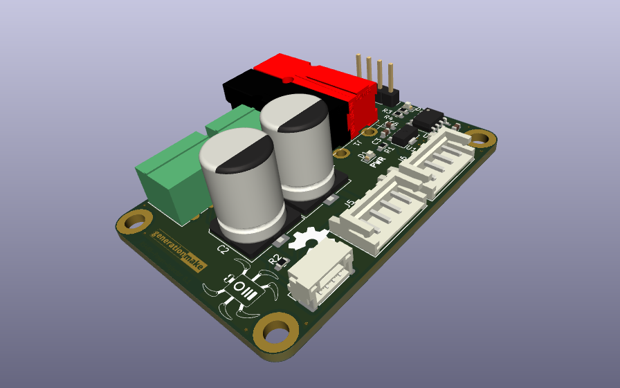

`RS485-Power-Injector`
======================

This repository contains the design files for [L3X-Z](https://github.com/107-systems/l3xz)'s RS485 power injector which allows to directly inject battery power into the RS485 bus connecting the robot's Dynamixel MX-28AR servos.

  

  

## Debug circuitry

This board contains a circuit with a RS485 driver to drive a LED to show bus activity. This circuit can also be used to interface the RS485 bus to a controller or computer. The circuit can be used with 3.3V and 5V levels. Some parts need to be changed to achieve this.

| **Designator** | **3.3V version** | **5V version** |
|:--------------:|:----------------:|:--------------:|
| U1             | L78L33ACUTR      | L78L05ACUTR    |
| U2             | SP3485EN-L       | SN75176AD      |

## Connectors

### Power Input J1
Anderson Power Pole

| **Pin** | **Signal**    |       **Description**        |
|:-------:|:-------------:|:----------------------------:|
| 1       | +BATT         | Directly to Dynamixel        |
| 2       | GND           |                              |

The input voltage is directly feed to the Dynamixel servo. So the maximum voltage depends solely on the servo used.

### Power Input J2
Würth WR-TBL 3.5mm 2-pin screw terminal.

| **Pin** | **Signal**    |       **Description**        |
|:-------:|:-------------:|:----------------------------:|
| 1       | +BATT         | Directly to Dynamixel        |
| 2       | GND           |                              |

### RS485 Input J3
Würth WR-TBL 3.5mm 3-pin screw terminal.

| **Pin** | **Signal**    |       **Description**        |
|:-------:|:-------------:|:----------------------------:|
| 1       | RS485-A       | Directly to Dynamixel        |
| 2       | RS485-B       | Directly to Dynamixel        |
| 3       | GND           |                              |

### RS485 Input J4
JST GH 1.25mm 4-pin.

| **Pin** | **Signal**    |       **Description**        |
|:-------:|:-------------:|:----------------------------:|
| 1       | +BATT         | to Dynamixel via R2          |
| 2       | RS485-A       | Directly to Dynamixel        |
| 3       | RS485-B       | Directly to Dynamixel        |
| 4       | GND           |                              |

### Dynamixel connectors J5 and J6
In the Dynamixel world there exist two type of connectors: Molex Mini-SPOX (https://www.molex.com/molex/products/part-detail/pcb_headers/0022035045) and JST EH (https://www.jst-mfg.com/product/pdf/eng/eEH.pdf)

Both are 2.5 mm pitch and use the same pin out and both can be mounted on the board. So you can decide which one to use and which fits your application and servo.

| **Pin** | **Signal**    |       **Description**        |
|:-------:|:-------------:|:----------------------------:|
| 1       | GND           |                              |
| 2       | +BATT         |                              |
| 3       | RS485-A       |                              |
| 4       | RS485-B       |                              |

### RS485 Debug output J7
Pin header 2.54mm 4-pin.

| **Pin** | **Signal**    |       **Description**        |
|:-------:|:-------------:|:----------------------------:|
| 1       | RS485_TXEN    |                              |
| 2       | RS485_TX      |                              |
| 3       | RS485_RX      |                              |
| 4       | GND           |                              |

## Enclosure

There exists a 3D printable enclosure to encapsulate the PCB.

### Standard

  

## PCB
### Top

  

### Bottom

  

